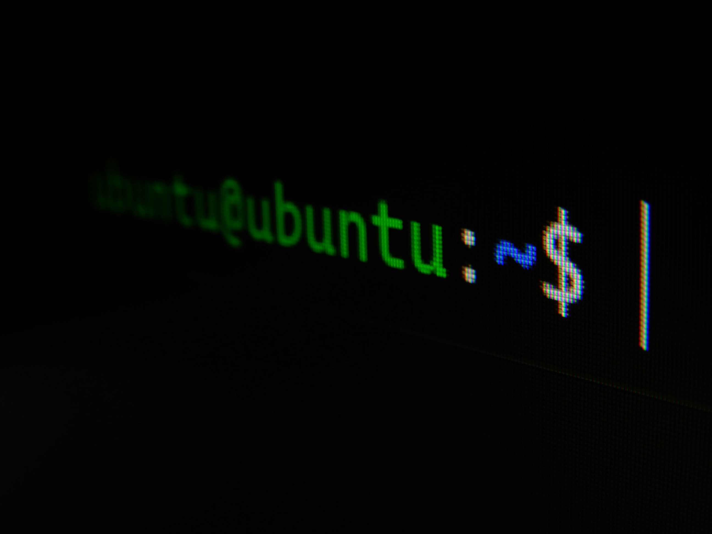

# How to create files in Terminal

After navigating with `cd` to the directory where you want a new file, there are a few options for creating one via the CLI. Here are **three**!

## 1. `touch`

The `touch` command's arguments are, at minimum, the name of an empty file you'd like to create:
```sh
touch index.html
```
You can create several files simultaneously, referencing their file paths as needed, by separating their file names with spaces:
```sh
touch index.html ./js/app.js
```
`touch` updates the modification time stamp for the file; calling it on a file that already exists will update the modification time.

### Some flags for `touch`


| flag | description |
|:---|:---|
| -A | adjust access and modification times (-a or -m for just one or the other) |
|-t | change access + modification times to the specified ("[[CC]YY]MMDDhhmm[.SS]") time. Can be used for time travel.

I found the `-t` flag to be amusing, as it lets you set a date in the future; 100 years from today, Jan. 30th 2125, for example:

```sh
touch -t "212501301200" index.html
```
*(However, the year is capped at 2262.)*

For more information, check out the documentation by entering `man touch` in the CLI.

## 2. `>`

Usually used for writing to a file, **output redirection**, written with `>`, can also be used to create a file if the target file doesn't exist:

```sh
echo '<h1>Hello word</h1>' > index.html
```

> Output redirection normally writes to a file. But if that file doesn't yet exist, it'll be created!

We can take this a step further by using the built-in `:` character, which has no effect, to create an empty file:

```sh
:> index.html
```

> However, output redirection will only create the first file needed; `:> index.html style.css` will only create the first file listed.

### 3. `truncate`

The `truncate` command is intended to cap or extend the length of files, but will create the file if it isn't already created. Together with its `-s` flag, which lets us specify a file length, we can write:
```sh
truncate -s 0 index.html
```
This will create a file of length 0, i.e., empty.

`truncate` can also create multiple files simultaneously:

```sh
truncate -s 0 index.html style.css
```

However, it loses the keystroke battle to `touch`, as it is a bit longer and requires flags.

For more information, check out the documentation by entering `man truncate` in the CLI.